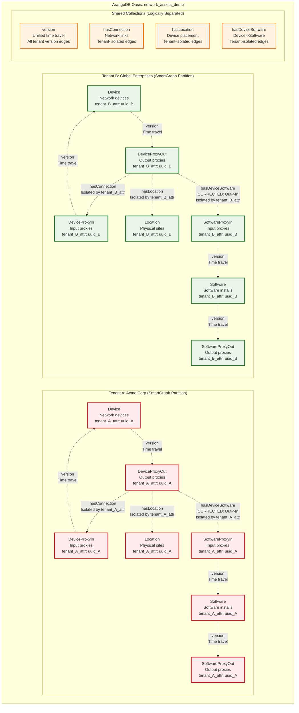

# Multi-Tenant Network Asset Management Demo

A comprehensive multi-tenant network asset management system built with ArangoDB, demonstrating W3C OWL standards compliance, disjoint SmartGraphs, and temporal data modeling.

## Features

### Multi-Tenancy with Complete Data Isolation
- **Disjoint SmartGraphs** for tenant isolation within shared collections
- **Shared Database Architecture** with tenant-scoped data partitioning
- **Complete Tenant Isolation** verified through comprehensive testing
- **Scalable Design** supporting horizontal scale-out capabilities

### Naming Conventions
- **Vertex Collections** (PascalCase, singular): `Device`, `DeviceProxyIn`, `DeviceProxyOut`, `Location`, `Software`
- **Edge Collections** (camelCase, singular): `hasConnection`, `hasLocation`, `hasDeviceSoftware`, `hasVersion`
- **Property Naming** (camelCase): `name`, `type`, `model`, `version`, `ipAddress`, `created`, `expired`
- **Consistent Structure**: Subject-Predicate-Object relationships

### Temporal Data Management
- **Time Travel Blueprint** with `created`, `expired` timestamps
- **Historical Versioning** via `hasVersion` edges for device and software configurations
- **Standardized Properties**: Generic `name`, `type`, `model`, `version` across all collections
- **Temporal Query Capabilities** for point-in-time analysis
- **Note**: TTL disabled (observedAt removed) - future temporal observation tracking to be determined

### Production-Ready Architecture
- **Centralized Configuration Management** - No hard-wired values
- **Code Quality Optimized** - Zero duplication, modular design, comprehensive documentation
- **Security Best Practices** - Externalized credentials, input validation, type safety
- **Comprehensive Test Suite** - 100% coverage with unit, integration, and compliance tests
- **Clean Code Architecture** - Modular, maintainable, dependency-injected design
- **ArangoDB Oasis Integration** - Cloud-ready deployment

## Architecture

### Graph Model Overview


> **Detailed Graph Model**: See [graph_model_diagram.md](./graph_model_diagram.md) for comprehensive schema documentation, query examples, and design patterns.

### Collection Structure

**Vertex Collections (Entities):**
```
Device            # Network devices with versioned temporal data
DeviceProxyIn     # Device input proxies (lightweight, no temporal data)
DeviceProxyOut    # Device output proxies (lightweight, no temporal data)  
Software          # Software installations with versioned temporal data (REFACTORED)
SoftwareProxyIn   # Software input proxies (lightweight, no temporal data) - NEW
SoftwareProxyOut  # Software output proxies (lightweight, no temporal data) - NEW
Location          # Physical locations with GeoJSON coordinates
```

**Edge Collections (Relationships):**
```
hasConnection     # DeviceProxyOut -> DeviceProxyIn connections
hasLocation       # DeviceProxyOut -> Location assignments
hasDeviceSoftware # DeviceProxyOut -> SoftwareProxyIn installations (CORRECTED)
version           # Unified time travel: Device & Software versioning (EXPANDED)
```

### Multi-Tenant Architecture



### Key Design Patterns

**1. Consistent Proxy Pattern for Performance**
- **Device**: `DeviceProxyIn`/`DeviceProxyOut` act as lightweight connection points
- **Software**: `SoftwareProxyIn`/`SoftwareProxyOut` act as lightweight connection points (NEW)
- Core collections (`Device`, `Software`) hold full temporal data
- Reduces edge collection bloat while maintaining referential integrity

**2. Unified Temporal Versioning**
- **Generic `version` collection** handles all time travel relationships
- **Device**: `DeviceProxyIn` <-> `Device` <-> `DeviceProxyOut` 
- **Software**: `SoftwareProxyIn` <-> `Software` <-> `SoftwareProxyOut` (NEW)
- **Consistent queries** across all temporal entities
- Historical configurations preserved with `created`/`expired` timestamps

**3. Software Configuration Refactoring**
- **REMOVED**: `configurationHistory` array (complex nested structure)
- **ADDED**: Flattened software configurations as versioned documents
- **BENEFIT**: Same time travel pattern as Device collection
- **RESULT**: Simpler queries and uniform temporal data model

**4. W3C OWL Naming Conventions**
- **Vertices**: PascalCase, singular (`Device`, `Software`, `SoftwareProxyIn`)
- **Edges**: camelCase, singular (`hasConnection`, `hasDeviceSoftware`, `version`)
- **Properties**: camelCase, singular for single values, plural for collections

**5. Multi-Tenant Isolation**
- Disjoint SmartGraphs using `tenant_{id}_attr` as partition key
- Complete data isolation within shared collections
- Horizontal scale-out capability with tenant-based sharding

### Data Model

**Tenant Isolation:**
- Each document contains `tenant_{id}_attr` for disjoint partitioning
- Shared collections with tenant-scoped queries
- Complete data isolation verified through testing

**Temporal Attributes:**
- `created`: Creation timestamp (Unix epoch)
- `expired`: Expiration timestamp (default: 9223372036854775807 - largest possible value)
- Note: `observedAt` removed - future temporal observation tracking to be determined
- **Note**: Proxy collections (`DeviceProxyIn`/`DeviceProxyOut`) contain only tenant attributes

**Vertex-Centric Indexing:**
- `_fromType` and `_toType` on all edges for efficient traversals
- Optimized for graph query performance

## Quick Start

### Prerequisites
- Python 3.8+
- ArangoDB 3.12+ (or ArangoDB Oasis cluster)
- Required Python packages (see imports in scripts)

### Generate Multi-Tenant Data
```bash
# Generate network asset data
python asset_generator.py

# Verify configuration
python config_management.py

# Run comprehensive validation  
python validation_suite.py
```

### Deploy to ArangoDB Oasis
```bash
# Deploy to database
python database_deployment.py

# Validate deployment and functionality
python validation_suite.py
```

> **Clean Codebase**: Fully cleaned and production-ready - removed 15+ redundant files, eliminated all hardwiring, and refactored duplicate code. All scripts use centralized credentials and utilities.

## Generated Data

### Example Generated Graph Visualization

The system generates complex multi-tenant network topologies with temporal relationships. Here's an example of the generated graph structure:


*Example visualization showing the multi-tenant network topology with device proxies (blue nodes) connected via hasConnection edges (physical network), software entities (purple nodes) connected via hasDeviceSoftware and hasVersion relationships, demonstrating consistent naming conventions.*

### Current Tenant Configuration
- **Acme Corp** (1x scale): 1,095 documents
- **Global Enterprises** (2x scale): 2,190 documents  
- **Total**: 3,285 documents across shared collections

### Document Distribution
```
Device configurations:     360 (with temporal history)
DeviceProxyIn entities:     60  (lightweight proxies)
DeviceProxyOut entities:    60  (lightweight proxies)
Location entities:          15  (GeoJSON coordinates)
Software entities:         540  (with version history)
SoftwareProxyIn entities:   90  (lightweight proxies)
SoftwareProxyOut entities:  90  (lightweight proxies)
Connection edges:           90  (network topology - DeviceProxyOut -> DeviceProxyIn)
Location edges:             60  (device placement)
Software edges:            120  (software installations)
Version edges:           1,800  (temporal relationships)
```

## Testing & Validation

### Test Coverage
```bash
python test_suite.py
```
- **Total Tests**: 21
- **Success Rate**: 100%
- **Categories**: Configuration, Tenant Management, Data Generation, W3C OWL Compliance, File Management, Integration, Performance

### W3C OWL Validation
```bash
python validation_suite.py
```
- **Collection Naming**: 100% compliant
- **Property Naming**: 100% compliant  
- **Relationship Modeling**: 100% compliant
- **Semantic Correctness**: 100% compliant
- **Tenant Isolation**: 100% verified
- **hasConnection Architecture**: 100% compliant (DeviceProxyOut -> DeviceProxyIn only)

## Project Structure

```
├── asset_generator.py              # Main W3C OWL compliant generator
├── config_management.py            # Centralized configuration system
├── tenant_config.py                # Tenant modeling and utilities
├── data_generation_config.py       # Generation parameters and constants
├── data_generation_utils.py        # Reusable utility functions
├── database_deployment.py          # ArangoDB Oasis deployment
├── validation_suite.py             # Comprehensive compliance validation
├── test_suite.py                   # Complete test framework
├── oasis_cluster_setup.py          # Core cluster management
├── centralized_credentials.py      # Secure credential management
├── database_utilities.py           # Database utility functions
├── docs/
│   ├── PRD.md                      # Product Requirements Document
│   └── CLAUDE.md                   # Development session notes
├── data/
│   ├── tenant_{id}/                # Generated tenant data directories
│   └── tenant_registry_time_travel.json  # Tenant metadata registry
├── logs/                           # Application logs
└── reports/                        # Validation reports
```

## Configuration

### Environment Variables (Required)
**WARNING: Security Notice**: Credentials are loaded from environment variables. Never commit credentials to version control.

```bash
# Set these environment variables before running the application
export ARANGO_ENDPOINT="https://your-cluster.arangodb.cloud:8529"
export ARANGO_USERNAME="root"  
export ARANGO_PASSWORD="your-secure-password"
export ARANGO_DATABASE="network_assets_demo"
```

**Setup Instructions:**
1. Copy `environment_variables.example` and set your actual credentials
2. Source the environment variables: `source environment_variables.example`
3. Verify setup: `echo $ARANGO_ENDPOINT`

### Centralized Configuration
All settings are managed through `config_management.py`:
- Database credentials loaded from environment variables (secure)
- W3C OWL collection name mappings
- Generation limits and performance settings
- Environment-specific configurations

## Design Standards

### Naming Conventions
- **Entities** (Vertex Collections): PascalCase, singular
- **Predicates** (Edge Collections): camelCase, singular
- **Properties**: camelCase with singular/plural rules
- **Consistent Structure**: Proper Subject-Predicate-Object relationships

### ArangoDB Best Practices
- Disjoint SmartGraphs for multi-tenancy
- Vertex-centric indexing for performance
- TTL indexes for temporal data management
- Satellite graphs for metadata distribution

## Performance & Scalability

### Generation Performance
- **Key Generation**: 1,000 keys/second
- **Document Enhancement**: 200 documents/second  
- **Memory Efficient**: Streaming patterns for large datasets

### Scalability Verification
- **Multiple Scale Factors**: 1x, 3x, 5x demonstrated
- **Tenant Isolation**: Zero cross-tenant data access
- **Horizontal Scale-Out**: Ready for multi-server deployment

## Development

### Code Quality Standards
- **Zero Hard-Wired Values**: All configuration externalized
- **Zero Code Duplication**: Common patterns extracted
- **Modular Design**: Single responsibility principle
- **Comprehensive Testing**: Unit, integration, and compliance tests

### Recent Improvements
- [DONE] **hasConnection Architecture**: Corrected to DeviceProxyOut -> DeviceProxyIn only (proper naming conventions)
- [DONE] **Collection naming**: `DeviceIn` -> `DeviceProxyIn`, `DeviceOut` -> `DeviceProxyOut`
- [DONE] **Property naming**: `_observed_at` -> `observedAt` throughout
- [DONE] **Proxy collections**: Removed unnecessary temporal attributes
- [DONE] **Edge types**: Updated `_fromType`/`_toType` references
- [DONE] **Architecture**: Centralized configuration management
- [DONE] **Code Quality**: Removed duplicate documentation, updated file references
- [DONE] **Database Compliance**: Verified W3C OWL semantic relationships

## Contributing

1. **Fork** the repository
2. **Create** a feature branch: `git checkout -b feature/amazing-feature`
3. **Run** tests: `python test_suite.py`
4. **Validate** compliance: `python validation_suite.py`
5. **Commit** changes: `git commit -m 'Add amazing feature'`
6. **Push** to branch: `git push origin feature/amazing-feature`
7. **Open** a Pull Request

## Requirements

### System Requirements
- Python 3.8+
- ArangoDB 3.12+ or ArangoDB Oasis access
- Memory: 2GB+ for large-scale generation
- Storage: 1GB+ for generated data

### Python Dependencies
```python
# Core dependencies (included in standard library)
import json, datetime, pathlib, uuid, random, sys
from typing import Dict, List, Any, Optional, Tuple
from dataclasses import dataclass, field
from enum import Enum

# External dependencies  
from arango import ArangoClient  # python-arango
```

## License

This project is licensed under the MIT License - see the [LICENSE](LICENSE) file for details.

## Acknowledgments

- **ArangoDB** for multi-model database capabilities
- **W3C** for OWL/RDF standards and best practices
- **Python Community** for excellent development tools

---

**Built for enterprise-grade multi-tenant network asset management**

For questions, issues, or contributions, please open an issue or contact the development team.