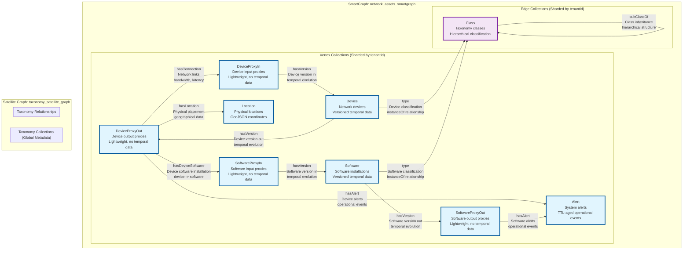
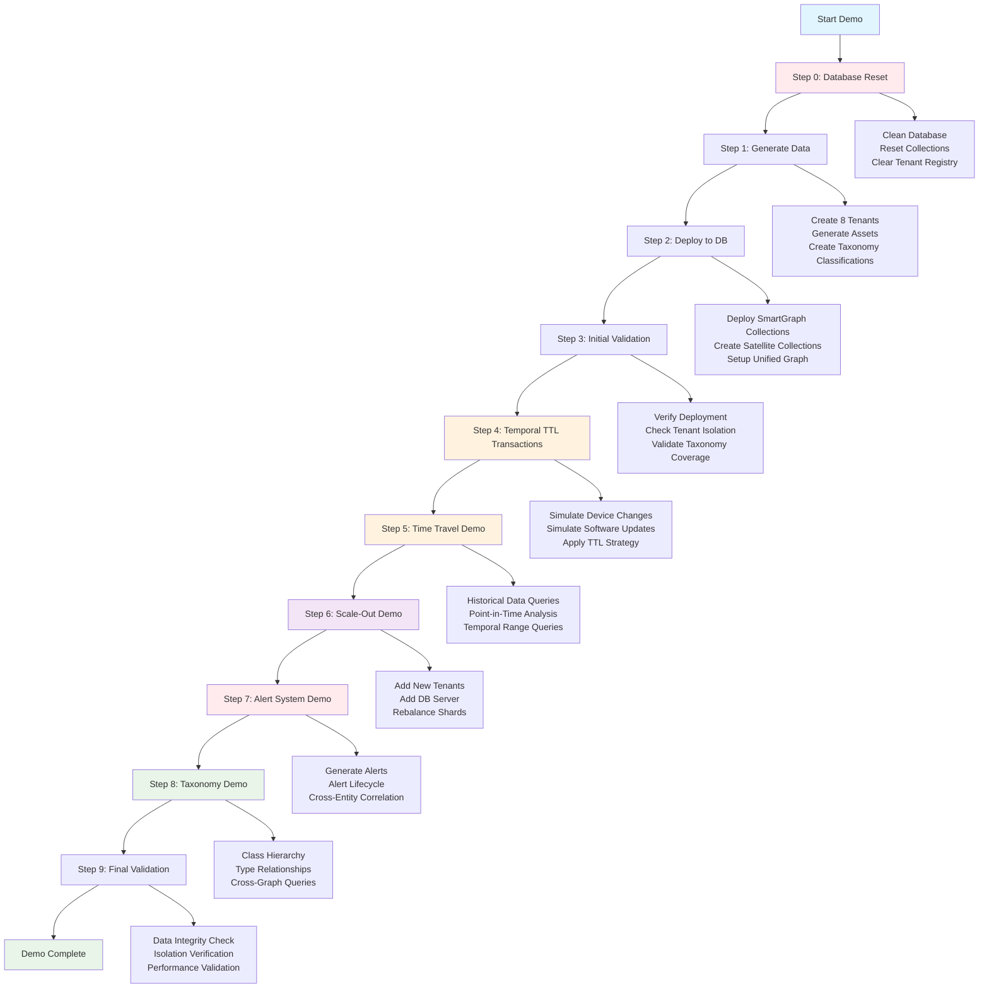

# Scalable Multi-Tenant Temporal Graph Reference Implementation

## Why Scalable Multi-Tenancy with Time-Traveling Graphs?

### The Business Challenge

Modern enterprises increasingly need **scalable SaaS platforms** that can serve multiple customers (tenants) while maintaining strict data isolation and providing rich temporal analytics. Traditional relational databases struggle with the complex, interconnected nature of enterprise data, especially when customers need to:

- **Track relationships** between assets, users, and configurations over time
- **Analyze historical changes** and their impact across interconnected systems  
- **Scale efficiently** to serve thousands of tenants without compromising performance
- **Maintain strict data isolation** while sharing infrastructure costs

### Ideal Use Cases for Multi-Tenant Time-Traveling Graphs

This architecture pattern is particularly valuable for **hosted enterprise solutions** where relationship modeling and temporal analysis are critical:

**Network Asset Management (IAM/Security)**
- Track devices, software, users, and their relationships over time
- Analyze security incidents by replaying network state at specific timestamps
- Monitor configuration changes and their downstream effects
- Demonstrate compliance with historical audit trails

**Identity and Access Management (IAM)**
- Model complex user-role-resource relationships across organizational hierarchies
- Track permission changes and access patterns over time
- Analyze privilege escalation and de-escalation workflows
- Support compliance auditing with temporal queries

**Cybersecurity and Threat Intelligence**
- Map attack vectors across interconnected systems and timeframes
- Track malware propagation through network relationships
- Analyze behavioral patterns across historical incident data
- Correlate threat indicators across multiple tenant environments

**Cloud Infrastructure Management**
- Model complex dependencies between services, containers, and infrastructure
- Track resource allocation and utilization patterns over time
- Analyze cost attribution across organizational units and time periods
- Support capacity planning with historical usage data

**Business Process Intelligence**
- Track workflow states and transitions across complex business processes
- Analyze process performance and bottlenecks over time
- Model organizational structures and their evolution
- Support regulatory compliance with complete audit trails

### Reference Implementation Focus: Network Asset Management

This reference implementation uses **network asset management** as a concrete example to demonstrate scalable multi-tenant temporal graph patterns. The architectural patterns shown here - entity relationships, configuration tracking, temporal queries, and tenant isolation - provide reusable templates for enterprise applications across multiple domains.

**What You'll See Demonstrated:**
- Multiple isolated tenants sharing infrastructure while maintaining data separation
- Complex device-software-location relationships modeled as interconnected graphs
- Real-time configuration changes with historical state preservation
- Time-travel queries that replay network state at specific points in time
- Automatic scale-out capabilities for handling growing tenant workloads
- Production-ready TTL data lifecycle management

---

## Technical Implementation

A comprehensive reference implementation showcasing scalable multi-tenant temporal graph architectures with ArangoDB, featuring production-ready patterns for tenant isolation, time travel capabilities, and horizontal scale-out.

## Core Technical Features

### Multi-Tenancy with Complete Data Isolation
- **Disjoint SmartGraphs** for tenant isolation within shared collections
- **Shared Database Architecture** with tenant-scoped data partitioning  
- **Complete Tenant Isolation** verified through comprehensive testing
- **Scalable Design** supporting horizontal scale-out to thousands of tenants

### Time-Traveling Graph Capabilities
- **Temporal Data Modeling** with `created` and `expired` timestamp fields
- **Point-in-Time Queries** to replay system state at any historical moment
- **Configuration Change Tracking** with complete audit trails
- **TTL-Based Data Lifecycle Management** for automatic historical data cleanup

### Enterprise-Grade Graph Features
- **Complex Relationship Modeling** supporting multi-hop traversals
- **MDI-Prefix Multi-Dimensional Indexes** for optimized temporal range queries
- **Smart Graph Partitioning** for distributed performance at scale
- **ACID Transactions** ensuring data consistency across tenant operations

### Naming Conventions

The system uses camelCase naming convention:

#### camelCase (Current Implementation)
- **Vertex Collections** (PascalCase, singular): `Device`, `DeviceProxyIn`, `DeviceProxyOut`, `Location`, `Software`, `SoftwareProxyIn`, `SoftwareProxyOut`, `Class`, `Alert`
- **Edge Collections** (camelCase, singular): `hasConnection`, `hasLocation`, `hasDeviceSoftware`, `hasVersion`, `type`, `subClassOf`, `hasAlert`
- **Property Naming** (camelCase): `name`, `type`, `model`, `version`, `ipAddress`, `created`, `expired`, `tenantId`

The system maintains **consistent structure** and full SmartGraph + Satellite architecture support.

## Prerequisites for Demo Presentation

### Required Infrastructure

#### ArangoDB Cluster Configuration
- **3-Node Cluster Minimum**: Required for demonstrating sharded graph capabilities
- **Sharded Graph Support**: Cluster must be configured to support ArangoDB SmartGraphs
- **Oasis Cloud Deployment**: Recommended for optimal performance and management features
- **Administrative Access**: Full cluster administration privileges required for server management

#### Network and Access Requirements
- **Stable Internet Connection**: Required for ArangoDB Oasis cluster access
- **Web Browser**: Modern browser for ArangoDB Web Interface access
- **SSH/Terminal Access**: For running demo scripts and monitoring

### Required Technical Skills

#### ArangoDB Web Interface Proficiency
The demo presenter must be comfortable navigating and using the following ArangoDB Web Interface components:

**Collection Dashboard**:
- View and understand collection statistics (document counts, index usage)
- Navigate between vertex and edge collections
- Interpret collection properties and sharding information
- Monitor real-time collection metrics during demo

**Graph Visualizer**:
- Create and configure graph visualizations
- Navigate complex multi-tenant graph structures
- Use vertex/edge filtering for specific tenant data
- Demonstrate traversal patterns and relationship exploration
- Copy/paste vertex IDs for targeted visualization

**Query Editor (AQL)**:
- Execute AQL queries for data verification
- Demonstrate temporal queries (time travel capabilities)
- Run TTL monitoring queries to show aging data
- Execute tenant isolation verification queries
- Interpret query execution plans and performance metrics

#### Cluster Management Skills

**Server Addition Process**:
- Access ArangoDB Oasis deployment management
- Navigate to deployment scaling options
- Add database servers to existing cluster
- Monitor server provisioning progress
- Verify new server integration

**Shard Rebalancing Operations**:
- Access cluster shard distribution view
- Understand current shard allocation across servers
- Initiate shard rebalancing operations
- Monitor rebalancing progress and completion
- Verify optimal shard distribution post-rebalancing
- Interpret performance impact of rebalancing

### Demo Flow Preparation

#### Pre-Demo Setup Checklist
1. **Cluster Status Verification**: Confirm 3-node cluster is healthy and accessible
2. **Database Access Verification**: Ensure cluster administrative credentials are configured
3. **Environment Variables**: Set required ArangoDB connection variables (ARANGO_ENDPOINT, ARANGO_USERNAME, ARANGO_PASSWORD, ARANGO_DATABASE)
4. **Web Interface Access**: Test all required ArangoDB Web Interface components
5. **Demo Script Familiarity**: Review automated demo walkthrough script and manual steps

**Note**: The demo will automatically create the `network_assets_demo` database if it doesn't exist, so manual database creation is not required.

## Enhanced Demo Capabilities

### Interactive Demo Walkthrough

The system includes a comprehensive, interactive demo walkthrough script that guides presenters through all system capabilities:

```bash
# Interactive mode (recommended for live presentations)
python3 demos/automated_demo_walkthrough.py --interactive

# Automated mode (for testing and development)
python3 demos/automated_demo_walkthrough.py --auto-advance --pause-duration 2
```

#### Demo Flow Structure

**Step 0: Database Reset and Cleanup**
- Automatically clears previous demo data
- Ensures consistent 8-tenant baseline
- Removes existing collections and graphs
- Resets tenant registry for fresh demonstration

**Step 1: Initial Data Generation**
- Generates 8 diverse tenant configurations
- Creates realistic network asset relationships
- Implements temporal data model with TTL fields
- Generates taxonomy classifications (100% coverage)
- Produces tenant-specific JSON data files

**Step 2: Database Deployment with SmartGraphs**
- Automatically creates database if not exists
- Deploys SmartGraph collections with MDI-prefix indexes
- Creates Satellite collections for taxonomy metadata
- Configures unified SmartGraph for tenant isolation
- Loads multi-tenant data with proper partitioning

**Step 3: Initial Validation and Testing**
- Verifies tenant isolation and data integrity
- Validates naming convention compliance
- Tests MDI-prefix index functionality
- Confirms SmartGraph + Satellite configuration
- Validates taxonomy classification coverage

**Step 4: Temporal TTL Transactions Demonstration**
- Executes real database transactions (not simulations)
- Creates new configuration versions with TTL timestamps
- Demonstrates temporal data lifecycle management
- Shows automatic aging of historical records (10-minute TTL for demo)

**Step 5: Time Travel Demonstration**
- Queries historical data within TTL window
- Shows point-in-time analysis capabilities
- Demonstrates temporal range queries
- Validates time travel blueprint implementation

**Step 6: Scale-Out Operations**
- Guides cluster server addition process
- Demonstrates shard rebalancing procedures
- Shows dynamic tenant addition capabilities
- Validates performance optimization

**Step 7: Alert System Demonstration**
- Generates real-time operational alerts
- Demonstrates alert lifecycle management
- Shows cross-entity alert correlation
- Validates SmartGraph alert integration

**Step 8: Taxonomy System Demonstration**
- Explores hierarchical device/software classification
- Demonstrates Class inheritance relationships
- Shows type edge connectivity (Device/Software -> Class)
- Validates cross-graph taxonomy queries

**Step 9: Final Validation**
- Comprehensive system validation
- Performance metric analysis
- Tenant isolation verification
- Enterprise readiness confirmation

### Key Demo Enhancements

**Professional Presentation**:
- ASCII-only output (no emojis or unicode)
- Clear section headers and progress indicators
- Interactive pauses for audience engagement
- Real-time verification queries

**Technical Accuracy**:
- Real transactions instead of simulations
- Actual TTL aging demonstration (5 minutes)
- Full vertex IDs for graph visualization
- Comprehensive error handling and recovery

**Cluster Management**:
- Interactive guidance for manual server addition
- Step-by-step shard rebalancing instructions
- ArangoDB Oasis Web Interface integration
- Performance impact monitoring

#### During Demo Requirements
- **Real-time Monitoring**: Ability to switch between demo script and web interface
- **Query Execution**: Comfortable executing verification queries during presentation
- **Troubleshooting**: Basic ArangoDB error interpretation and resolution
- **Audience Interaction**: Ability to answer questions about graph structures and performance

#### Post-Demo Capabilities
- **Cleanup Operations**: Optional database reset and tenant data regeneration
- **Performance Analysis**: Review query execution metrics and cluster utilization
- **Scale-out Verification**: Confirm cluster optimization and improved performance

### Recommended Training Resources

- **ArangoDB University**: SmartGraphs and Cluster Management courses
- **ArangoDB Documentation**: Cluster administration and sharding concepts
- **Hands-on Practice**: Recommended 2-3 practice runs before live demonstration

### Temporal Data Management

**Time Travel Architecture:**
- **Time Travel Blueprint** with `created`, `expired` timestamps for point-in-time queries
- **MDI-Prefix Multi-Dimensional Indexes** for optimal temporal range query performance
- **Historical Versioning** via unified `hasVersion` edges for device and software configurations
- **Standardized Properties**: Generic `name`, `type`, `model`, `version` across all collections

**TTL (Time-To-Live) Strategy:**
- **Current vs Historical Strategy**: Current configurations never expire (`expired = NEVER_EXPIRES`), historical configurations age out automatically
- **Dual-Field Approach**: 
  - `expired` field for time travel queries (`expired > point_in_time`)
  - `ttlExpireAt` field for ArangoDB TTL indexes (automatic deletion)
- **Production TTL**: 30 days for historical data lifecycle management
- **Demo TTL**: 10 minutes for visible aging demonstration
- **Sparse TTL Indexes**: Only historical documents have `ttlExpireAt` field

**Transaction Process:**
1. **New Configuration**: `created = now()`, `expired = NEVER_EXPIRES`, no `ttlExpireAt`
2. **Old Configuration**: `expired = now()`, `ttlExpireAt = now() + TTL_INTERVAL`
3. **Automatic Cleanup**: ArangoDB removes expired historical documents when `ttlExpireAt` timestamp is reached

#### Demo Mode TTL Configuration

For demonstration purposes, the system supports **Demo Mode** with accelerated TTL aging:

**Demo Mode Activation:**
```bash
# Deploy with demo mode (10-minute TTL)
PYTHONPATH=. python3 src/database/database_deployment.py --demo-mode

# Run interactive demo walkthrough (automatically uses demo mode)
PYTHONPATH=. python3 demos/automated_demo_walkthrough.py --interactive
```

**Demo TTL Behavior:**
- **Historical documents**: Age out after 10 minutes instead of 30 days
- **Visible aging**: Allows observers to see TTL cleanup during demo
- **Real-time monitoring**: Use `ttl_monitor.py` to watch aging process

**TTL Monitoring Commands:**
```bash
# Show current TTL status
PYTHONPATH=. python3 src/ttl/ttl_monitor.py --status-only

# Live monitoring for 15 minutes
PYTHONPATH=. python3 src/ttl/ttl_monitor.py --duration 15

# Custom monitoring (5 minutes, refresh every 10 seconds)  
PYTHONPATH=. python3 src/ttl/ttl_monitor.py --duration 5 --refresh 10
```

**Demo Timeline Example**:
1. **T+0**: Create configuration, generate historical data
2. **T+5min**: Run transaction simulation, create more historical data
3. **T+10min**: First historical documents begin aging out
4. **T+15min**: All initial historical documents aged out
5. **T+20min**: Recent historical documents aged out

### Enhanced Time Travel & Graph Capabilities (NEW)
- **Advanced Traversal Queries** - Complex multi-hop graph queries for latest and historical configurations
- **Point-in-Time Reconstruction** - Rebuild complete network state at any timestamp
- **Device-Software Relationship Mapping** - Full relationship tracking across time periods
- **Unified Transaction + TTL Flow** - Integrated lifecycle management with real-time aging
- **Bug Diagnosis & Fix Tools** - Comprehensive toolset for identifying and resolving issues
- **Real-Time Aging Demonstrations** - Watch configurations age out with live TTL monitoring

### Production-Ready Architecture
- **Centralized Configuration Management** - No hard-wired values
- **Code Quality Optimized** - Zero duplication, modular design, comprehensive documentation
- **Security Best Practices** - Externalized credentials, input validation, type safety
- **Comprehensive Test Suite** - 100% coverage with unit, integration, and compliance tests
- **Clean Code Architecture** - Modular, maintainable, dependency-injected design
- **ArangoDB Oasis Integration** - Cloud-ready deployment

## Architecture

### Graph Model Overview



> **Architecture**: Unified SmartGraph for tenant-isolated data with Satellite Graph for shared taxonomy metadata. Cross-graph `type` edges connect tenant entities to global classification system.

### Collection Structure

**SmartGraph Collections (Tenant-Isolated):**
```
Device            # Network devices with versioned temporal data
DeviceProxyIn     # Device input proxies (lightweight, no temporal data)
DeviceProxyOut    # Device output proxies (lightweight, no temporal data)  
Software          # Software installations with versioned temporal data
SoftwareProxyIn   # Software input proxies (lightweight, no temporal data)
SoftwareProxyOut  # Software output proxies (lightweight, no temporal data)
Location          # Physical locations with GeoJSON coordinates
Alert             # System alerts with TTL-aged operational events
```

**Satellite Collections (Global Metadata):**
```
Class             # Taxonomy classes (shared across all tenants)
```

**SmartGraph Edge Collections (Tenant-Isolated):**
```
hasConnection     # DeviceProxyOut -> DeviceProxyIn connections
hasLocation       # DeviceProxyOut -> Location assignments
hasDeviceSoftware # DeviceProxyOut -> SoftwareProxyIn installations
hasVersion        # Unified time travel: Device & Software versioning
hasAlert          # DeviceProxyOut/SoftwareProxyOut -> Alert relationships
type              # Device/Software -> Class classifications (cross-graph)
```

**Satellite Edge Collections (Global Metadata):**
```
subClassOf        # Class -> Class inheritance relationships
```

### Key Design Patterns

**1. Consistent Proxy Pattern for Performance**
- **Device**: `DeviceProxyIn`/`DeviceProxyOut` act as lightweight connection points
- **Software**: `SoftwareProxyIn`/`SoftwareProxyOut` act as lightweight connection points
- Core collections (`Device`, `Software`) hold full temporal data
- Reduces edge collection bloat while maintaining referential integrity

**2. Unified Temporal Versioning**
- **Generic `hasVersion` collection** handles all time travel relationships
- **Device**: `DeviceProxyIn` <-> `Device` <-> `DeviceProxyOut` 
- **Software**: `SoftwareProxyIn` <-> `Software` <-> `SoftwareProxyOut`
- **Consistent queries** across all temporal entities
- Historical configurations preserved with `created`/`expired` timestamps

**3. SmartGraph + Satellite Architecture**
- **SmartGraph Collections**: Tenant-isolated data with automatic sharding by `tenantId`
- **Satellite Collections**: Global taxonomy metadata replicated across all nodes
- **Cross-Graph Relationships**: `type` edges connect tenant entities to shared taxonomy
- **Complete Isolation**: Physical separation ensures enterprise-grade security

**4. Taxonomy Classification System**
- **100% Coverage**: Every device and software entity has a `type` edge to its class
- **Hierarchical Structure**: Classes connected via `subClassOf` inheritance relationships  
- **Fallback Classification**: Automatic assignment to base classes if specific classification fails
- **Consistent Metadata**: Same taxonomy hierarchy available to all tenants

**5. Alert System Integration**
- **Operational Monitoring**: Real-time alert generation from devices and software
- **TTL-Managed Lifecycle**: Alerts automatically age out based on resolution status
- **SmartGraph Integration**: Alert relationships properly isolated by tenant
- **Cross-Entity Correlation**: Alerts can originate from any monitored entity

### Data Model

**Tenant Isolation:**
- Each document contains `tenantId` property for disjoint partitioning
- Unified graph with tenant-scoped queries using `tenantId`
- Complete data isolation verified through testing and validation suite

**Temporal Attributes:**
- `created`: Creation timestamp (Unix epoch)
- `expired`: Expiration timestamp for time travel (NEVER_EXPIRES for current configurations)
- `ttlExpireAt`: TTL field for historical document aging (only present on historical documents)
- Current vs Historical strategy: Current configs have no TTL, historical configs age out

**MDI-Prefix Multi-Dimensional Indexes:**
- Optimized temporal range queries on `created` and `expired` fields (timestamp data)
- Enhanced performance for time travel and point-in-time queries
- Applied to Device, Software, and hasVersion collections
- Correctly implements the time travel blueprint recommendation for temporal data

**TTL (Time-To-Live) Indexes:**
- Automatic aging of historical data with configurable expiration periods
- Demo mode: 10-minute TTL for visible aging demonstration
- Production mode: 30-day TTL for practical data lifecycle management

## Getting Started

### Quick Start - Demo Options

**[RECOMMENDED] Interactive Automated Walkthrough**
```bash
# Interactive guided demonstration with database visibility
PYTHONPATH=. python3 demos/automated_demo_walkthrough.py --interactive

# Auto-advancing demonstration with timed pauses
PYTHONPATH=. python3 demos/automated_demo_walkthrough.py --auto-advance --pause-duration 5
```

**Enhanced Demo Features:**
- **ACTUAL database state** shown before and after transactions
- **Specific document keys** provided for ArangoDB Web Interface monitoring
- **Graph visualization guidance** with exact vertex paths to explore
- **Real-time TTL field activation** during transaction execution
- **Complete visibility** into "Current vs Historical" TTL strategy

**[TOOLS] Database Management**
```bash
# Reset database to clean state before demos
PYTHONPATH=. python3 demos/automated_demo_walkthrough.py --reset-only
```

**Individual Demo Components**
```bash
# Data Generation Only
PYTHONPATH=. python3 src/data_generation/asset_generator.py

# Database Deployment Only  
PYTHONPATH=. python3 src/database/database_deployment.py

# Transaction Simulation Only
PYTHONPATH=. python3 src/simulation/transaction_simulator.py --devices 5 --software 3

# Validation Only
PYTHONPATH=. python3 src/validation/validation_suite.py
```

**The comprehensive demo includes:**
1. **Initial Data Generation** - Multi-tenant network asset data (8 tenants by default) with complete taxonomy classification
2. **Database Deployment** - SmartGraph collections, Satellite collections, and unified graph architecture
3. **Enhanced Transaction + TTL Demo** - Configuration changes with immediate TTL activation and database visibility
4. **Time Travel Demonstration** - Historical queries and point-in-time analysis scenarios
5. **Scale-Out Demo** - Dynamic tenant addition and cluster analysis (8 initial + 8 new = 16 total tenants)
6. **Alert System Demo** - Real-time operational monitoring with alert lifecycle management
7. **Taxonomy System Demo** - Hierarchical classification exploration and cross-graph taxonomy queries
8. **Comprehensive Validation** - Data integrity, tenant isolation, and enterprise readiness checks

### Enhanced Scale-Out Demo Features

**Optimized for Balanced Shard Distribution:**
- **Initial Configuration**: 8 tenants across 3 database servers
- **Scale-Out Process**: Add 8 additional tenants dynamically  
- **Server Addition**: Add 1 additional database server (3 -> 4 servers)
- **Perfect Balance**: 16 SmartGraphs distributed evenly across 4 servers (4 graphs per server)
- **Visual Impact**: Clear demonstration of optimal shard rebalancing

**Scale-Out Tenant Companies:**
- CloudSync Systems, DataFlow Corp, NetWork Industries
- SecureNet Solutions, GlobalTech Networks, ConnectWise Infrastructure  
- NextGen Communications, Unified Systems Corp

### Enhanced Transaction + TTL Demo Features

The demo now addresses common concerns about transaction and TTL visibility:

**Database Visibility**
- **Pre-Transaction State**: Shows specific documents to watch before changes
- **Watch List**: Provides exact document keys to monitor in ArangoDB Web Interface
- **Field-Level Tracking**: Shows `expired` and `ttlExpireAt` field changes in real-time
- **Interactive Pauses**: Allows time to check database state during the demo

**Unified Transaction + TTL Process**
- **Immediate TTL Activation**: Transactions set TTL fields immediately (not separately)
- **Real-Time Impact**: Shows historical documents get `ttlExpireAt` timestamps
- **Current vs Historical**: Demonstrates current configs never expire, historical configs age out
- **10-Minute Demo TTL**: Accelerated aging for visible demonstration

**Step-by-Step Process**
1. **Database State**: Shows current documents before transactions
2. **Transaction Execution**: Updates configurations with immediate TTL field setting
3. **Field Verification**: Confirms TTL timestamps are set on historical documents
4. **Aging Monitoring**: Provides tools to watch documents age out in 10 minutes

### Demo Flow Diagram



### Automated Demo Walkthrough

The **automated walkthrough** provides a guided tour of all system capabilities with detailed explanations:

#### Features:
- **[MENU] Step-by-step explanations** of each component
- **[PAUSE] Interactive pauses** for observation and learning
- **[TARGET] Complete system coverage** in logical sequence
- **[SETUP] Error handling** and graceful recovery
- **[STATS] Results summaries** after each section

#### Walkthrough Sections:
0. **Database Reset and Cleanup** - Clean state for fresh demonstration
1. **System Introduction** - Overview and capabilities
2. **Data Generation** - Multi-tenant data creation (8 tenants) with taxonomy
3. **Database Deployment** - SmartGraphs, Satellite collections, and indexes
4. **Initial Validation** - System integrity and taxonomy coverage checks
5. **Temporal TTL Transactions** - Configuration changes with TTL
6. **Time Travel Demonstration** - Historical queries and point-in-time analysis
7. **Scale-Out Demo** - Add tenants, servers, rebalance shards
8. **Alert System Demonstration** - Real-time operational monitoring
9. **Taxonomy System Demonstration** - Hierarchical classification and cross-graph queries
10. **Final Validation** - Comprehensive system verification
11. **Demo Summary** - Results and achievements

#### Usage Options:
```bash
# Interactive mode (recommended for presentations)
python3 demos/automated_demo_walkthrough.py --interactive

# Auto-advance mode (for unattended demos)
python3 demos/automated_demo_walkthrough.py --auto-advance --pause-duration 3

# View all options
python3 demos/automated_demo_walkthrough.py --help
```

### Individual Demo Components

For running specific parts of the demonstration:

```bash
# Data Generation Only
PYTHONPATH=. python3 src/data_generation/asset_generator.py

# Generate specific number of tenants
PYTHONPATH=. python3 src/data_generation/asset_generator.py --tenants 6

# Database Deployment Only  
PYTHONPATH=. python3 src/database/database_deployment.py

# Transaction Simulation Only
PYTHONPATH=. python3 src/simulation/transaction_simulator.py --devices 5 --software 3

# Validation Only
PYTHONPATH=. python3 src/validation/validation_suite.py
```

### Prerequisites
- **Python 3.8+** with standard libraries
- **ArangoDB 3.12+** or ArangoDB Oasis cluster access
- **Environment Variables** configured (see Configuration section below)

### Manual Step-by-Step Setup

#### Step 1: Configure Environment

First, set up your database credentials:

```bash
# Required environment variables
export ARANGO_ENDPOINT="https://your-cluster.arangodb.cloud:8529"
export ARANGO_USERNAME="root"
export ARANGO_PASSWORD="your-secure-password"
export ARANGO_DATABASE="network_assets_demo"

# Verify configuration
echo "Endpoint: $ARANGO_ENDPOINT"
echo "Database: $ARANGO_DATABASE"
```

#### Step 2: Generate Multi-Tenant Data

Choose your data generation approach:

#### Option A: Default Generation (Recommended)
```bash
# Generate data with camelCase naming (default)
python3 src/data_generation/asset_generator.py

# Generate data with snake_case naming
python3 src/data_generation/asset_generator.py --naming snake_case

# This creates:
# - Acme Corp (1x scale): ~1,095 documents
# - Global Enterprises (2x scale): ~2,190 documents  
# - Total: ~3,285 documents across all collections
```

#### Option B: Custom Tenant Configuration
```bash
# Edit tenant_config.py to customize:
# - Tenant names and IDs
# - Scale factors (1x, 2x, 3x, 5x)
# - Device/software/location counts per tenant

# Then generate with custom settings
PYTHONPATH=. python3 src/data_generation/asset_generator.py
```

#### Option C: Single Tenant Testing
```bash
# For development/testing with minimal data
# Modify data_generation_config.py:
# - Set DEVICE_COUNT = 5
# - Set SOFTWARE_COUNT = 10
# - Set LOCATION_COUNT = 2

PYTHONPATH=. python3 src/data_generation/asset_generator.py
```

#### Step 3: Deploy to Database

**Recommended: Use the Interactive Demo Walkthrough**
```bash
# Complete guided demonstration (automatic database creation)
PYTHONPATH=. python3 demos/automated_demo_walkthrough.py --interactive

# Quick automated run for testing
PYTHONPATH=. python3 demos/automated_demo_walkthrough.py --auto-advance --pause-duration 2
```

**Note**: `PYTHONPATH=.` is required due to the modular folder structure (`src/`, `demos/`, etc.)

**Alternative: Manual deployment methods**

#### Option A: Fresh Database Deployment
```bash
# Deploy with camelCase naming (default)
PYTHONPATH=. python3 src/database/database_deployment.py

# Deploy with snake_case naming
PYTHONPATH=. python3 src/database/database_deployment.py --naming snake_case

# This will:
# 1. Create/recreate the database
# 2. Set up all collections and indexes with chosen naming convention
# 3. Load tenant data from generated JSON files
# 4. Create tenant-specific SmartGraphs
# 5. Verify deployment integrity
```

#### Option B: Update Existing Database
```bash
# Load new tenant data into existing database
# (Preserves existing data, adds new tenants)
PYTHONPATH=. python3 src/database/database_deployment.py --incremental

# This will:
# 1. Connect to existing database
# 2. Create missing collections/indexes
# 3. Load only new tenant data
# 4. Maintain existing tenant isolation
```

#### Step 4: Validate Deployment

Run comprehensive validation:

```bash
# Full validation suite
PYTHONPATH=. python3 src/validation/validation_suite.py

# Quick database check
PYTHONPATH=. python3 src/database/database_utilities.py
```

## Troubleshooting

### Python Command Issues

If you encounter `python: command not found` errors:

```bash
# Use python3 instead of python (already updated in all scripts)
python3 demos/automated_demo_walkthrough.py --interactive

# Check your Python installation
which python3
python3 --version

# If using pyenv, ensure Python is properly configured
pyenv versions
pyenv global 3.11.11  # or your preferred version
```

### Environment Setup

Ensure you have the required environment variables set:

```bash
# Required ArangoDB credentials
export ARANGO_ENDPOINT="https://your-cluster.arangodb.cloud:8529"
export ARANGO_USERNAME="root"
export ARANGO_PASSWORD="your-password"
export ARANGO_DATABASE="network_assets_demo"
```

### Common Issues

- **Import Errors**: Ensure all project files are in the same directory
- **Connection Errors**: Verify ArangoDB credentials and network connectivity
- **Permission Errors**: Check file permissions for data and logs directories

### Bug Fixes and Diagnostic Tools

**System Validation and Diagnostics**
Run comprehensive validation to identify and diagnose issues:
```bash
# Full system validation
PYTHONPATH=. python3 src/validation/validation_suite.py

# Database utilities and diagnostics  
PYTHONPATH=. python3 src/database/database_utilities.py
```

**TTL and Transaction Monitoring**
Monitor TTL behavior and transaction results:
```bash
# Monitor TTL aging in real-time
PYTHONPATH=. python3 src/ttl/ttl_monitor.py --duration 15

# Check TTL status
PYTHONPATH=. python3 src/ttl/ttl_monitor.py --status-only

# Run transaction simulation with monitoring
PYTHONPATH=. python3 src/simulation/transaction_simulator.py --devices 5 --software 3
```

## Scale-Out Capabilities

### Dynamic Tenant Addition

Add new tenants to existing database without disrupting operations:

```bash
# Add tenants using the scale-out manager
PYTHONPATH=. python3 src/simulation/scale_out_manager.py --operation add-tenant --tenant-name "New Corp" --scale-factor 2

# Add multiple demo tenants
PYTHONPATH=. python3 src/simulation/scale_out_manager.py --operation add-tenants

# Run complete scale-out demonstration via automated walkthrough
PYTHONPATH=. python3 demos/automated_demo_walkthrough.py --interactive
```

### Database Server Scaling

Analyze cluster state to prepare for manual server addition:

```bash
# Analyze current cluster state
PYTHONPATH=. python3 src/simulation/scale_out_manager.py --operation server-info

# Analyze shard distribution for rebalancing planning
PYTHONPATH=. python3 src/simulation/scale_out_manager.py --operation shard-info
```

**Note**: Database server addition is performed manually through the ArangoDB Oasis web interface.

### Scale-Out Benefits

- **Zero Downtime**: Add tenants without affecting existing operations
- **Linear Scaling**: Performance scales with additional servers  
- **Data Isolation**: Complete tenant separation maintained via SmartGraphs
- **Cost Efficiency**: Shared infrastructure with isolated data
- **Operational Simplicity**: Centralized management with tenant autonomy

For detailed scale-out instructions, see the Scale-Out Demo section in the automated walkthrough.

## Data Generation Options

### Scale Factors
Control data volume per tenant:
- **1x scale**: 60 devices, 90 software, 5 locations
- **2x scale**: 120 devices, 180 software, 10 locations  
- **3x scale**: 180 devices, 270 software, 15 locations
- **5x scale**: 300 devices, 450 software, 25 locations

### Tenant Customization
Edit `src/config/tenant_config.py` to modify:
```python
# Example custom tenant
create_tenant_config(
    tenant_name="Your Company",
    scale_factor=2,  # 2x data volume
    # Generates tenant_id automatically
)
```

### Data Types Generated
Each tenant gets:
- **Device entities**: Network devices with temporal history
- **DeviceProxy entities**: Lightweight connection points
- **Software entities**: Applications with version tracking
- **SoftwareProxy entities**: Software connection points
- **Location entities**: Geographic placement data
- **Relationship edges**: Network topology and associations
- **Taxonomy classifications**: Device/Software -> Class relationships

## Deployment Scenarios

### Scenario 1: Demo/Development
```bash
# Minimal data for testing
PYTHONPATH=. python3 src/data_generation/asset_generator.py --environment development
PYTHONPATH=. python3 src/database/database_deployment.py
```

### Scenario 2: Multi-Tenant Production
```bash
# Full-scale multi-tenant deployment
PYTHONPATH=. python3 src/data_generation/asset_generator.py
PYTHONPATH=. python3 src/database/database_deployment.py
PYTHONPATH=. python3 src/validation/validation_suite.py
```

### Scenario 3: Custom Enterprise Setup
```bash
# 1. Customize src/config/tenant_config.py with your tenants
# 2. Adjust scale factors as needed
PYTHONPATH=. python3 src/data_generation/asset_generator.py
PYTHONPATH=. python3 src/database/database_deployment.py

# 3. Verify tenant isolation
PYTHONPATH=. python3 src/validation/validation_suite.py
```

### Scenario 4: Add New Tenants
```bash
# 1. Add new tenant configs to src/config/tenant_config.py
# 2. Generate data (preserves existing tenants)
PYTHONPATH=. python3 src/data_generation/asset_generator.py

# 3. Deploy only new tenants
PYTHONPATH=. python3 src/database/database_deployment.py --incremental

# 4. Validate isolation maintained
PYTHONPATH=. python3 src/validation/validation_suite.py
```

## Generated Data

### Example Generated Graph Visualization

The system generates complex multi-tenant network topologies with temporal relationships. Here's an example of the generated graph structure:


*Example visualization showing the multi-tenant network topology with device proxies (blue nodes) connected via hasConnection edges (physical network), software entities (purple nodes) connected via hasDeviceSoftware and hasVersion relationships, demonstrating consistent naming conventions.*

### Current Tenant Configuration
- **Acme Corp** (1x scale): 1,095 documents
- **Global Enterprises** (2x scale): 2,190 documents  
- **Total**: 3,285 documents across shared collections

### Document Distribution
```
Device configurations:     360 (with temporal history)
DeviceProxyIn entities:     60  (lightweight proxies)
DeviceProxyOut entities:    60  (lightweight proxies)
Location entities:          15  (GeoJSON coordinates)
Software entities:         540  (with version history)
SoftwareProxyIn entities:   90  (lightweight proxies)
SoftwareProxyOut entities:  90  (lightweight proxies)
Connection edges:           90  (network topology - DeviceProxyOut -> DeviceProxyIn)
Location edges:             60  (device placement)
Software edges:            120  (software installations)
hasVersion edges:        1,800  (temporal relationships)
```

## Testing & Validation

### Test Coverage
```bash
PYTHONPATH=. python3 src/validation/test_suite.py
```
- **Total Tests**: 21
- **Success Rate**: 100%
- **Categories**: Configuration, Tenant Management, Data Generation, Naming Convention Compliance, File Management, Integration, Performance

### Naming Convention Validation
```bash
python3 src/validation/validation_suite.py
```
- **Collection Naming**: 100% compliant
- **Property Naming**: 100% compliant  
- **Relationship Modeling**: 100% compliant
- **Naming Consistency**: 100% compliant
- **Tenant Isolation**: 100% verified
- **hasConnection Architecture**: 100% compliant (DeviceProxyOut -> DeviceProxyIn only)

## Project Structure

```
- src/
  - config/
    - config_management.py            # Centralized configuration system
    - tenant_config.py                # Tenant modeling and utilities  
    - centralized_credentials.py      # Secure credential management
    - taxonomy_constants.py           # Taxonomy class definitions
  - data_generation/
    - asset_generator.py              # Main data generation engine
    - data_generation_config.py       # Generation parameters and constants
    - data_generation_utils.py        # Reusable utility functions
    - taxonomy_generator.py           # Taxonomy classification system
    - alert_generator.py              # Alert system data generation
  - database/
    - database_deployment.py          # ArangoDB deployment and setup
    - database_utilities.py           # Database utility functions
  - validation/
    - validation_suite.py             # Comprehensive system validation
  - simulation/
    - transaction_simulator.py        # Real transaction execution with TTL
    - alert_simulator.py              # Alert generation and lifecycle
    - scale_out_manager.py            # Scale-out operations and tenant management
  - ttl/
    - ttl_constants.py               # TTL configuration constants
    - ttl_monitor.py                 # TTL monitoring utilities
- demos/
  - automated_demo_walkthrough.py    # Interactive demo presentation script
- data/
  - tenant_{id}/                     # Generated tenant data directories
  - tenant_registry_time_travel.json # Tenant metadata registry
- assets/                            # Documentation images and diagrams
- docs/                              # Additional documentation
- logs/                              # Application logs
- reports/                           # Validation and performance reports
```

## Architecture Notes

### SmartGraph + Satellite Architecture

The system uses **ArangoDB SmartGraphs with Satellite Collections** for optimal multi-tenant isolation and performance:

**SmartGraph Collections:**
- **Tenant Data Isolation**: All tenant-specific collections use `tenantId` as the SmartGraph attribute
- **Automatic Sharding**: Documents are automatically distributed based on `tenantId`  
- **Complete Separation**: Each tenant's data is physically isolated on specific shards
- **Cross-Tenant Prevention**: Impossible to access other tenant's data without explicit `tenantId`

**Satellite Collections:**
- **Global Metadata**: Taxonomy classes shared across all tenants
- **High Availability**: Replicated to all cluster nodes for optimal read performance
- **Consistent Classification**: Same taxonomy hierarchy available to all tenants

**Benefits:**
- **Enterprise-Grade Isolation**: Physical separation ensures complete tenant security
- **Linear Scalability**: Add database servers to handle more tenants seamlessly
- **Optimal Performance**: Local data access with globally available metadata
- **Cost Efficiency**: Shared infrastructure with isolated data access

## Configuration

### Environment Variables (Required)
**WARNING: Security Notice**: Credentials are loaded from environment variables. Never commit credentials to version control.

```bash
# Set these environment variables before running the application
export ARANGO_ENDPOINT="https://your-cluster.arangodb.cloud:8529"
export ARANGO_USERNAME="root"  
export ARANGO_PASSWORD="your-secure-password"
export ARANGO_DATABASE="network_assets_demo"
```

**Setup Instructions:**
1. Set environment variables directly in your shell or create your own environment file
2. Export the environment variables: 
   ```bash
   export ARANGO_ENDPOINT="https://your-cluster.arangodb.cloud:8529"
   export ARANGO_USERNAME="root"  
   export ARANGO_PASSWORD="your-secure-password"
   export ARANGO_DATABASE="network_assets_demo"
   ```
3. Verify setup: `echo $ARANGO_ENDPOINT`

### Centralized Configuration
All settings are managed through `config_management.py`:
- Database credentials loaded from environment variables (secure)
- Collection name mappings for both naming conventions
- Generation limits and performance settings
- Environment-specific configurations

## Design Standards

### Naming Conventions
- **Entities** (Vertex Collections): PascalCase, singular
- **Predicates** (Edge Collections): camelCase, singular
- **Properties**: camelCase with singular/plural rules
- **Consistent Structure**: Proper Subject-Predicate-Object relationships

### ArangoDB Best Practices
- Disjoint SmartGraphs for multi-tenancy
- Vertex-centric indexing for performance
- TTL indexes for temporal data management
- Satellite graphs for metadata distribution

## Performance & Scalability

### Generation Performance
- **Key Generation**: 1,000 keys/second
- **Document Enhancement**: 200 documents/second  
- **Memory Efficient**: Streaming patterns for large datasets

### Scalability Verification
- **Multiple Scale Factors**: 1x, 3x, 5x demonstrated
- **Tenant Isolation**: Zero cross-tenant data access
- **Horizontal Scale-Out**: Ready for multi-server deployment

## Development

### Code Quality Standards
- **Zero Hard-Wired Values**: All configuration externalized
- **Zero Code Duplication**: Common patterns extracted
- **Modular Design**: Single responsibility principle
- **Comprehensive Testing**: Unit, integration, and compliance tests

- [DONE] **Architecture**: Centralized configuration management
- [DONE] **Code Quality**: Removed duplicate documentation, updated file references
- [DONE] **Database Compliance**: Verified consistent naming conventions

## Contributing

1. **Fork** the repository
2. **Create** a feature branch: `git checkout -b feature/amazing-feature`
3. **Run** tests: `PYTHONPATH=. python3 src/validation/test_suite.py`
4. **Validate** compliance: `PYTHONPATH=. python3 src/validation/validation_suite.py`
5. **Commit** changes: `git commit -m 'Add amazing feature'`
6. **Push** to branch: `git push origin feature/amazing-feature`
7. **Open** a Pull Request

## Requirements

### System Requirements
- Python 3.8+
- ArangoDB 3.12+ or ArangoDB Oasis access
- Memory: 2GB+ for large-scale generation
- Storage: 1GB+ for generated data

### Python Dependencies
```python
# Core dependencies (included in standard library)
import json, datetime, pathlib, uuid, random, sys
from typing import Dict, List, Any, Optional, Tuple
from dataclasses import dataclass, field
from enum import Enum

# External dependencies  
from arango import ArangoClient  # python-arango
```

## License

This project is licensed under the MIT License - see the [LICENSE](LICENSE) file for details.

## Acknowledgments

- **ArangoDB** for multi-model database capabilities
- **Industry Standards** for consistent naming conventions and best practices
- **Python Community** for excellent development tools

---

**Built for enterprise-grade multi-tenant network asset management**

For questions, issues, or contributions, please open an issue or contact the development team.