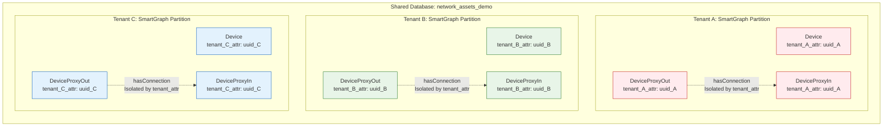
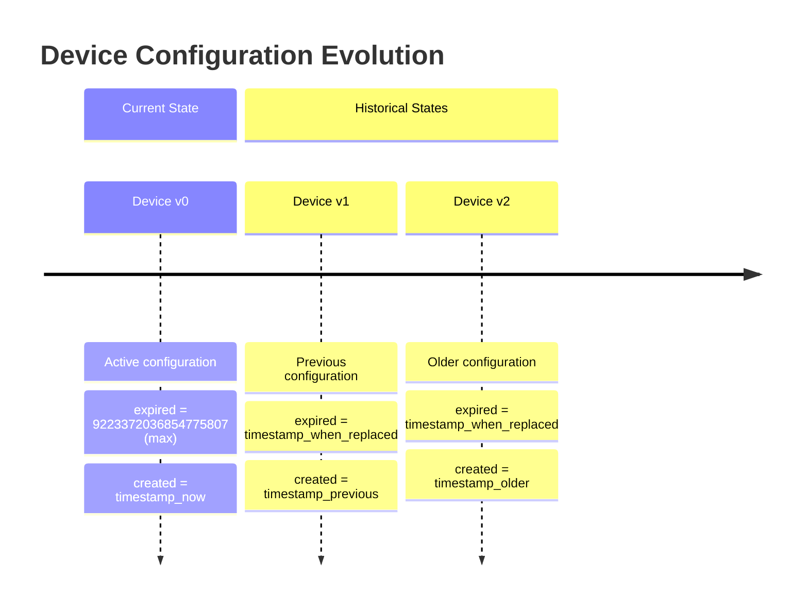

# Graph Model Diagram

## Network Asset Management Graph Schema

```mermaid
graph TB
    %% Vertex Collections (W3C OWL naming - PascalCase, singular)
    subgraph "Vertex Collections"
        D[Device<br/>[DEVICE] Network devices<br/>Versioned temporal data]
        DPI[DeviceProxyIn<br/>[IN] Device input proxies<br/>Lightweight, no temporal data]
        DPO[DeviceProxyOut<br/>[OUT] Device output proxies<br/>Lightweight, no temporal data]
        S[Software<br/>[SOFTWARE] Software installations<br/>Versioned temporal data]
        SPI[SoftwareProxyIn<br/>[IN] Software input proxies<br/>Lightweight, no temporal data]
        SPO[SoftwareProxyOut<br/>[OUT] Software output proxies<br/>Lightweight, no temporal data]
        L[Location<br/>[LOCATION] Physical locations<br/>GeoJSON coordinates]
    end
    
    %% Edge Collections (W3C OWL naming - camelCase, singular)
    
    %% Network connections between devices
    DPO -->|hasConnection<br/>[LINK] Network links<br/>bandwidth, latency| DPI
    
    %% Device location relationships
    DPO -->|hasLocation<br/>🏢 Physical placement<br/>geographical data| L
    
    %% Device-Software relationships (CORRECTED LOGIC)
    DPO -->|hasDeviceSoftware<br/>[CODE] Device software installation<br/>device → software| SPI
    
    %% Device Time Travel (existing pattern)
    DPI -->|version<br/>[METRICS] Device version in<br/>temporal evolution| D
    D -->|version<br/>📉 Device version out<br/>temporal evolution| DPO
    
    %% Software Time Travel (NEW pattern)
    SPI -->|version<br/>[METRICS] Software version in<br/>temporal evolution| S
    S -->|version<br/>📉 Software version out<br/>temporal evolution| SPO
    
    %% Tenant isolation indicator
    classDef tenantBox fill:#e1f5fe,stroke:#01579b,stroke-width:2px
    classDef newFeature fill:#e8f5e8,stroke:#2e7d32,stroke-width:3px
    class D,DPI,DPO,L tenantBox
    class S,SPI,SPO newFeature
    
    %% Edge styling
    classDef connectionEdge stroke:#4caf50,stroke-width:3px
    classDef locationEdge stroke:#ff9800,stroke-width:3px  
    classDef softwareEdge stroke:#9c27b0,stroke-width:3px
    classDef versionEdge stroke:#f44336,stroke-width:3px
```

## Collection Details

### Vertex Collections (PascalCase, singular)

| Collection | Purpose | Temporal Data | Key Attributes |
|------------|---------|---------------|----------------|
| **Device** | Core network devices | [DONE] Versioned temporal | `name`, `type`, `model`, `ipAddress`, `macAddress`, `created`, `expired` |
| **DeviceProxyIn** | Device input proxies | [ERROR] None | `name`, `type`, `tenant_attr` |
| **DeviceProxyOut** | Device output proxies | [ERROR] None | `name`, `type`, `tenant_attr` |
| **Software** | Software installations | [DONE] Versioned temporal | `name`, `type`, `version`, `portNumber`, `isEnabled`, `created`, `expired` |
| **SoftwareProxyIn** | Software input proxies | [ERROR] None | `name`, `type`, `version`, `tenant_attr` |
| **SoftwareProxyOut** | Software output proxies | [ERROR] None | `name`, `type`, `version`, `tenant_attr` |
| **Location** | Physical locations | [DONE] Full temporal | `name`, `streetAddress`, `geoLocation`, `created`, `expired` |

### Edge Collections (camelCase, singular)

| Collection | From → To | Purpose | Key Attributes |
|------------|-----------|---------|----------------|
| **hasConnection** | DeviceProxyOut → DeviceProxyIn | Network connectivity | `connectionType`, `bandwidthCapacity`, `networkLatency` |
| **hasLocation** | DeviceProxyOut → Location | Physical placement | Geographic relationships |
| **hasDeviceSoftware** | DeviceProxyOut → SoftwareProxyIn | Device software installation | Installation relationships |
| **hasVersion** | ALL proxies ⟷ versioned entities | Unified temporal versioning | `created`, `expired`, `_fromType`, `_toType` |

## Multi-Tenant Architecture



## Temporal Data Model



## Key Design Patterns

### 1. **Consistent Proxy Pattern for Performance**
- **Device**: `DeviceProxyIn`/`DeviceProxyOut` act as lightweight connection points
- **Software**: `SoftwareProxyIn`/`SoftwareProxyOut` act as lightweight connection points (NEW)
- Core collections (`Device`, `Software`) hold full temporal data
- Reduces edge collection bloat while maintaining referential integrity

### 2. **Unified Temporal Versioning**
- **Generic `version` collection** handles all time travel relationships
- **Device**: `DeviceProxyIn` ⟷ `Device` ⟷ `DeviceProxyOut` 
- **Software**: `SoftwareProxyIn` ⟷ `Software` ⟷ `SoftwareProxyOut` (NEW)
- **Type filtering** via `_fromType`/`_toType` attributes
- **Consistent queries** across all temporal entities

### 3. **Software Configuration Refactoring** 
- **REMOVED**: `configurationHistory` array (complex nested structure)
- **ADDED**: Flattened software configurations as versioned documents
- **BENEFIT**: Same time travel pattern as Device collection
- **RESULT**: Simpler queries and uniform temporal data model

### 4. **W3C OWL Naming Conventions**
- **Vertices**: PascalCase, singular (`Device`, `Software`, `SoftwareProxyIn`)
- **Edges**: camelCase, singular (`hasConnection`, `hasDeviceSoftware`, `version`)
- **Properties**: camelCase, singular/plural as appropriate

### 5. **Multi-Tenant Isolation**
- Disjoint SmartGraphs using `tenant_{id}_attr` as partition key
- Complete data isolation within shared collections
- Horizontal scale-out capability

## Graph Traversal Examples

### Find Device Network
```aql
FOR device IN Device
  FILTER device.tenant_acme_attr == "acme_uuid"
  FOR connection IN hasConnection
    FILTER connection._from LIKE CONCAT("DeviceProxyOut/", device._key)
    RETURN {device, connection}
```

### Unified Time Travel Query (Device & Software)
```aql
// Find all devices and software at a specific point in time
FOR entity IN UNION(
    (FOR d IN Device FILTER d.created <= @point_in_time AND d.expired > @point_in_time RETURN d),
    (FOR s IN Software FILTER s.created <= @point_in_time AND s.expired > @point_in_time RETURN s)
)
  RETURN entity
```

### Cross-Entity Time Travel Analysis (NEW)
```aql
// Find devices and their software at a specific point in time
FOR device IN Device
  FILTER device.created <= @point_in_time AND device.expired > @point_in_time
  FOR deviceProxy IN 1..1 OUTBOUND device version
    FILTER deviceProxy._fromType == "DeviceProxyOut"
    FOR softwareProxy IN 1..1 OUTBOUND deviceProxy hasDeviceSoftware  
      FOR software IN 1..1 OUTBOUND softwareProxy version
        FILTER software.created <= @point_in_time AND software.expired > @point_in_time
        RETURN {
          device: device,
          software: software,
          relationship: "device_uses_software_at_time"
        }
```

### Software Version History Query (NEW)
```aql
// Find all versions of a specific software
FOR softwareProxy IN SoftwareProxyIn
  FILTER softwareProxy._key == @software_proxy_key
  FOR software IN 1..1 OUTBOUND softwareProxy version
    SORT software.created DESC
    RETURN {
      version: software._key,
      configuration: {
        portNumber: software.portNumber,
        isEnabled: software.isEnabled
      },
      timespan: {
        created: software.created,
        expired: software.expired
      }
    }
```

### Performance Comparison Query
```aql
// Compare software configurations across time (before vs after refactoring)

// BEFORE (complex with configurationHistory array):
// FOR software IN Software
//   FOR config IN software.configurationHistory
//     FILTER config.created <= @time AND config.expired > @time
//     RETURN {software: software.softwareName, config: config}

// AFTER (simple with flattened documents):
FOR software IN Software
  FILTER software.created <= @time AND software.expired > @time
  RETURN {
    software: software.softwareName,
    config: {
      portNumber: software.portNumber,
      isEnabled: software.isEnabled
    }
  }
```

### Unified Version Collection Query (NEW)
```aql
// Query both device and software versions from single collection
FOR version IN version
  FILTER version._fromType IN ["DeviceProxyIn", "SoftwareProxyIn"]
  FILTER version.created <= @point_in_time AND version.expired > @point_in_time
  LET entityType = version._toType
  LET entity = DOCUMENT(version._to)
  RETURN {
    entityType: entityType,
    entity: entity,
    version: version
  }
```
