# Graph Model Diagram

## Network Asset Management Graph Schema

```mermaid
graph TB
    %% Vertex Collections (W3C OWL naming - PascalCase, singular)
    subgraph "Vertex Collections"
        D[Device<br/>📱 Network devices<br/>Full temporal data]
        DPI[DeviceProxyIn<br/>📥 Input proxies<br/>Lightweight, no temporal data]
        DPO[DeviceProxyOut<br/>📤 Output proxies<br/>Lightweight, no temporal data]
        L[Location<br/>📍 Physical locations<br/>GeoJSON coordinates]
        S[Software<br/>💿 Software installations<br/>Version history]
    end
    
    %% Edge Collections (W3C OWL naming - camelCase, singular)
    
    %% Network connections between devices
    DPO -->|hasConnection<br/>🔗 Network links<br/>bandwidth, latency| DPI
    
    %% Device location relationships
    DPO -->|hasLocation<br/>🏢 Physical placement<br/>geographical data| L
    
    %% Software installation relationships  
    DPO -->|hasSoftware<br/>💻 Installed software<br/>configurations| S
    
    %% Version relationships (temporal tracking)
    DPI -->|version<br/>📈 Version in<br/>temporal evolution| D
    D -->|version<br/>📉 Version out<br/>temporal evolution| DPO
    
    %% Tenant isolation indicator
    classDef tenantBox fill:#e1f5fe,stroke:#01579b,stroke-width:2px
    class D,DPI,DPO,L,S tenantBox
    
    %% Edge styling
    classDef connectionEdge stroke:#4caf50,stroke-width:3px
    classDef locationEdge stroke:#ff9800,stroke-width:3px  
    classDef softwareEdge stroke:#9c27b0,stroke-width:3px
    classDef versionEdge stroke:#f44336,stroke-width:3px
```



## Collection Details

### Vertex Collections (PascalCase, singular)

| Collection | Purpose | Temporal Data | Key Attributes |
|------------|---------|---------------|----------------|
| **Device** | Core network devices | ✅ Full temporal | `deviceName`, `deviceType`, `ipAddress`, `macAddress`, `created`, `expired` |
| **DeviceProxyIn** | Device input proxies | ❌ None | `deviceName`, `deviceType`, `tenant_attr` |
| **DeviceProxyOut** | Device output proxies | ❌ None | `deviceName`, `deviceType`, `tenant_attr` |
| **Location** | Physical locations | ✅ Full temporal | `locationName`, `streetAddress`, `geoLocation`, `created`, `expired` |
| **Software** | Software installations | ✅ Full temporal | `softwareName`, `softwareType`, `configurationHistory`, `created`, `expired` |

### Edge Collections (camelCase, singular)

| Collection | From → To | Purpose | Key Attributes |
|------------|-----------|---------|----------------|
| **hasConnection** | DeviceProxyOut → DeviceProxyIn | Network connectivity | `connectionType`, `bandwidthCapacity`, `networkLatency` |
| **hasLocation** | DeviceProxyOut → Location | Physical placement | Geographic relationships |
| **hasSoftware** | DeviceProxyOut → Software | Software installation | Installation configurations |
| **version** | DeviceProxyIn ⟷ Device ⟷ DeviceProxyOut | Temporal versioning | `created`, `expired`, version tracking |

## Multi-Tenant Architecture


## Temporal Data Model


## Key Design Patterns

### 1. **Proxy Pattern for Performance**
- `DeviceProxyIn`/`DeviceProxyOut` act as lightweight connection points
- Core `Device` collection holds full temporal data
- Reduces edge collection bloat

### 2. **Temporal Versioning**
- `version` edges link proxy → device → proxy
- Historical device configurations preserved
- Time travel queries supported

### 3. **W3C OWL Naming Conventions**
- **Vertices**: PascalCase, singular (`Device`, `Location`)
- **Edges**: camelCase, singular (`hasConnection`, `hasLocation`)
- **Properties**: camelCase, singular/plural as appropriate

### 4. **Multi-Tenant Isolation**
- Disjoint SmartGraphs using `tenant_{id}_attr` as partition key
- Complete data isolation within shared collections
- Horizontal scale-out capability

## Graph Traversal Examples

### Find Device Network
```aql
FOR device IN Device
  FILTER device.tenant_acme_attr == "acme_uuid"
  FOR connection IN hasConnection
    FILTER connection._from LIKE CONCAT("DeviceProxyOut/", device._key)
    RETURN {device, connection}
```

### Time Travel Query  
```aql
FOR device IN Device
  FILTER device.created <= @point_in_time 
  AND device.expired > @point_in_time
  RETURN device
```

### Cross-Collection Analysis
```aql
FOR device IN Device
  FOR location IN 1..1 OUTBOUND device hasLocation
  FOR software IN 1..1 OUTBOUND device hasSoftware
  RETURN {device, location, software}
```
